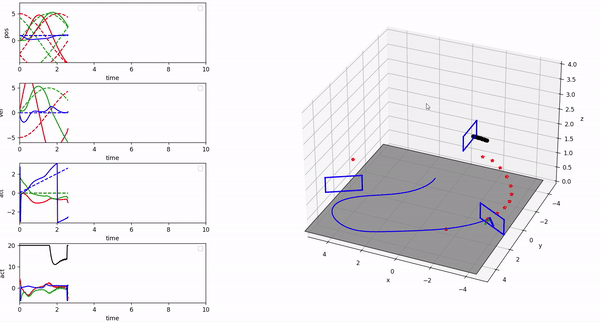

# Drone Navigation Through Moving Arches Using Model Predictive Control


## Overview

This project demonstrates a practical application of **Model Predictive Control (MPC)** to navigate a drone through moving gates, as part of a multi-agent system. The drone must pass through a series of dynamic gates, supported by terrestrial robots, while maintaining precise control and avoiding obstacles. The project is implemented in Python and utilizes various simulation environments to validate the control strategies.


## Table of Contents

- [Introduction](#introduction)
- [Project Structure](#project-structure)
- [Installation](#installation)
- [Usage](#usage)
- [Simulation](#simulation)
- [Real-world Testing](#real-world-testing)
- [Contributing](#contributing)
- [License](#license)

## Introduction

This project was developed as part of the Multi-Agent Systems course, where the main goal was to apply multi-agent control techniques integrated with advanced control methods like MPC. The system coordinates a drone with ground-based robots to achieve complex tasks in dynamic environments, such as passing through moving arches.

### Key Objectives:
- Implement multi-agent control with MPC for a drone navigating through dynamic gates.
- Validate the approach in simulation environments.
- Demonstrate potential applications in rescue operations, civil engineering, and security.




## Installation

To run this project, you need to have Python 3.8 or above installed. Clone this repository and install the required dependencies:

```bash
git clone https://github.com/yourusername/drone-mpc.git
cd drone-mpc
pip install -r requirements.txt
```

## Usage
### Running the Simulation
To start a simulation where the drone navigates through moving arches, run the following command:
```bash
python run_mpc.py
```
### Real-world Testing
It would need to have the same setup as we had at CentraleSupélec


## Simulation
In this project, several simulations were conducted to validate the control algorithms. Below is a brief overview of the simulations available:

- Pendulum Simulation: Various versions to test the control algorithm on a simpler system.
- Quadrotor Simulation: Tests the control of a drone with MPC in a simulated environment.
- Dynamic Gap Simulation: Focuses on the drone navigating through moving arches.

## Results

You can check the real life test [righ here](https://drive.google.com/file/d/1X0S3q_n_pOi_H2q8FrgK08xAch7DzjEj/view?usp=sharing)

## Acknowledgements

This work was heavily based on the [high_mpc repository](https://github.com/uzh-rpg/high_mpc) by the University of Zurich Robotics and Perception Group. The techniques and implementation details from this repository provided a significant foundation for the development and refinement of the control strategies used in this project.
